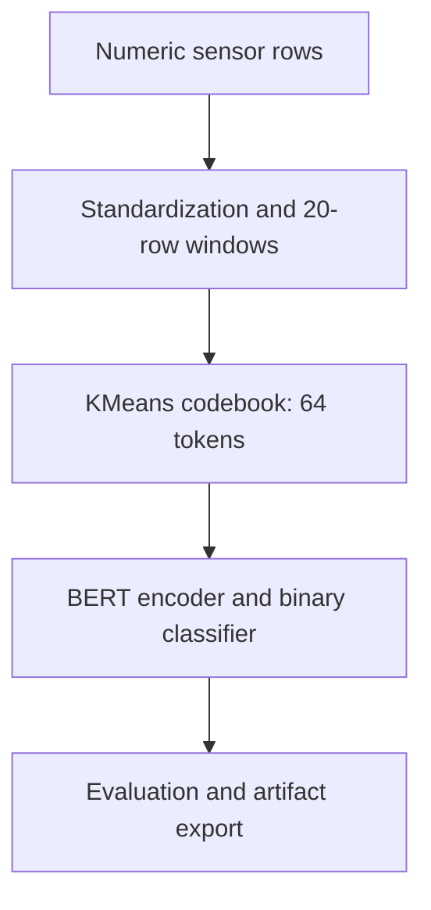
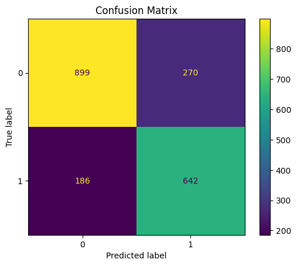

# Machine Failure Classification with Sensor Tokens and BERT

A notebook experiment that quantizes numeric machine sensor windows into discrete tokens and trains a compact BERT classifier to identify windows containing failure events.

**Academic group project · Python for Data Science and AI · Tokyo International University**

## Overview

This project explores whether a language-model architecture can learn patterns from numeric sensor sequences after vector quantization. Five sensor measurements are standardized, grouped into overlapping windows, and converted into token IDs using KMeans.

The model classifies whether **any recorded failure occurs within the input window**. The experiment does not establish advance warning of a future failure, a lead time, or performance on unseen industrial equipment.

## Pipeline



## Implementation

- **Inputs:** air temperature, process temperature, rotational speed, torque, and tool wear. IDs, product type, and failure-mode flags are excluded from model inputs.
- **Preparation:** forward/backward fill when missing values exist, followed by StandardScaler.
- **Windowing:** 20 rows per window, stride 1; the label is the maximum failure label within that window.
- **Tokenization:** KMeans with 64 clusters, `n_init=10`, and seed 42. Vocabulary size is 65, including padding ID 64.
- **Model:** `BertForSequenceClassification` initialized from `BertConfig`, with 4 encoder layers, 4 attention heads, hidden size 128, and intermediate size 512. It is trained from scratch; no pretrained text tokenizer or `bert-base-uncased` weights are used.
- **Training:** class-weighted cross-entropy through a custom Hugging Face Trainer; learning rate `3e-4`, 8 epochs, batch size 64.
- **Evaluation:** accuracy, failure-class F1, classification report, confusion matrix, ROC, and precision–recall curves.
- **Export:** model weights/config, KMeans codebook, and sensor scaler are written during execution. Trained artifacts are not included in this repository.

## Data and recorded results

The included [machine_failure.csv](machine_failure.csv) has the schema and counts of the synthetic [AI4I 2020 Predictive Maintenance Dataset](https://archive.ics.uci.edu/dataset/601/ai4i+2020+predictive+maintenance+dataset), UCI Machine Learning Repository, DOI [10.24432/C5HS5C](https://doi.org/10.24432/C5HS5C). The dataset is licensed under CC BY 4.0. These are synthetic measurements, not company data.

| Item | Recorded value |
|---|---:|
| Input rows | 10,000 |
| Normal / failure rows | 9,661 / 339 |
| Generated windows | 9,981 |
| Normal / failure windows | 5,974 / 4,007 |
| Training / evaluation windows | 7,984 / 1,997 |
| Evaluation accuracy | 0.771657 |
| Failure-class F1 | 0.737931 |

These metrics come from the saved outputs of [Last_project.ipynb](Last_project.ipynb), not a new benchmark run. The change in class distribution follows from labeling overlapping windows; it is not evidence of better model quality.



The recorded confusion matrix is `[[899, 270], [186, 642]]`, with actual classes on rows and predicted classes on columns.

### Evaluation limits

The notebook fits the scaler and KMeans **before** randomly splitting windows. Adjacent windows can share 19 of 20 rows across the training and evaluation sets, and preprocessing also sees evaluation data. The recorded scores therefore do not demonstrate generalization to independent sequences or machines.

A stronger evaluation would split raw rows or independent machine runs first, build non-overlapping partitions, fit preprocessing on training data only, and compare against simpler baselines. A future-failure task would also need labels strictly beyond the input window and an explicit prediction horizon.

## Getting started

### Google Colab

[Open the notebook in Colab](https://colab.research.google.com/github/minhiungan2608/machine-failure-prediction-bert/blob/main/Last_project.ipynb).

1. Download `machine_failure.csv` from this repository.
2. Run the notebook in order. If the CSV is absent, its setup cell opens a Colab upload dialog.
3. Upload the file using the exact name `machine_failure.csv`.
4. Inspect the evaluation cells and exported artifacts after training.

W&B logging is disabled by default for this notebook. Opt in by setting `WANDB_MODE` before its logging setup cell and configuring your own credentials outside the notebook.

### Local notebook

From a cloned repository, with Python 3.12:

```bash
python -m venv .venv
source .venv/bin/activate
python -m pip install -r requirements.txt
python -m notebook Last_project.ipynb
```

On Windows, activate with `.venv\Scripts\activate`. Start Jupyter from the repository root so the CSV can be found. The final archive cell uses the `zip` command; that cell is optional on systems without it. CPU execution is supported by the model code; runtime depends on hardware.

The dependency file retains the Transformers 4.x API used by the notebook. Installation and full model retraining have not been verified in a clean environment during the documentation pass.

## Repository structure

| Path | Purpose |
|---|---|
| `Last_project.ipynb` | EDA, windowing, quantization, training, evaluation, export, and inference |
| `machine_failure.csv` | Included synthetic tabular dataset |
| `assets/confusion-matrix.png` | Figure extracted from the recorded notebook output |
| `requirements.txt` | Local notebook dependencies |

## Engineering decisions

Quantization gives a Transformer a small vocabulary of sensor states without turning measurements into natural-language sentences. The codebook and scaler are exported with the model because inference must apply the same transformations.

The inference helper expects raw measurements in the five-sensor order. Its original final example passes already standardized data and scales it again; that example should not be used as evidence of calibrated inference. For a raw example, use:

```python
raw_example = pd.read_csv(DATA_PATH)[sensor_cols].iloc[:WINDOW_SIZE].to_numpy()
predict_window(raw_example)
```

The helper's padding mask also needs correction before accepting shorter windows; use exactly 20 rows for this experiment.

## Contributors

Hoang Khai Minh and Mai Anh Nghia. This is coursework, not a deployed predictive-maintenance system. No repository-wide software license has been specified.
